# COMP2150  - Level Design Document
### Name: Hunter Vary
### Student number: 46645713 

## 1. Player Experience
### 1.1. Discovery
My level approaches discovery by slowly exposing the player to new gameplay elements in order to facilitate learning and develop a sense of understanding of the game’s core mechanics. This clearly demonstrated in the way weapons pickups are introduced. When the player finds the staff weapon in section one they are met with a hallway. This hallway serves as a soft tutorial, introducing the main mechanics of the staff. It features a chomper which the player can now defeat with their new weapon, as well as a breakable wall which the level design of the encounter guides the player to. Because the wall is paired with the monster the player can infer the staff is the solution as well, immediately establishing mechanically what the staff is used for. The gun is introduced in a similar way where progression is blocked by a gate, with a switch in the wall. The player has no means of accessing the switch, but when travelling to the other side of the hallway and picking up the gun the player will experiment and test the gun on the switch which will open the gate and teach the player the mechanics of the gun.

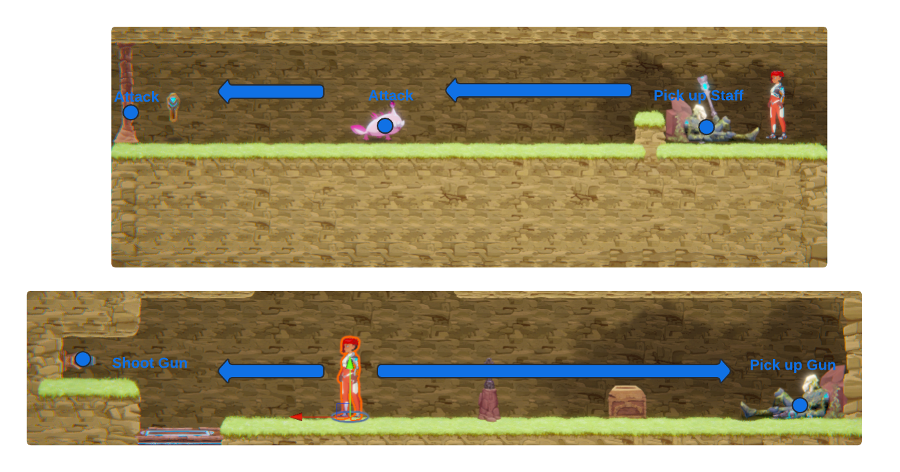

### 1.2. Drama
In the first section of the level there is an encounter where the player must fall down a one-way drop. As the player approaches the drop they see the first enemies (two chompers) they will encounter, only they are trapped above by a gate. This builds tension as it foreshadows their  involvement in the level, however the player may find some relief that they are trapped and unable to harm the player The geometry of the level forces the player to land on a pressure plate, thus activating the gate and causing the chompers to drop. This dramatically ups the intensity as the player now, in an unfamiliar area, having to make quick decisions under pressure. The player currently has no means of dealing with the chompers making them even more of a threat. Shortly after the chompers drop, a box drops on the other side of the level. This gives the player a clear goal in the disarray and is their key to escaping, creating a sense of relief in the tension. From here they must push the box to the other side while being pursued, from there they make their jump to safety. This is an example of my broader approach to drama in the level, by managing the intensity curve of each encounter to set the bar of tension with suspense, only to suddenly escalate it I create a memorable sensation of pressure which is relieved by the player’s own actions, creating a satisfying sense of drama.

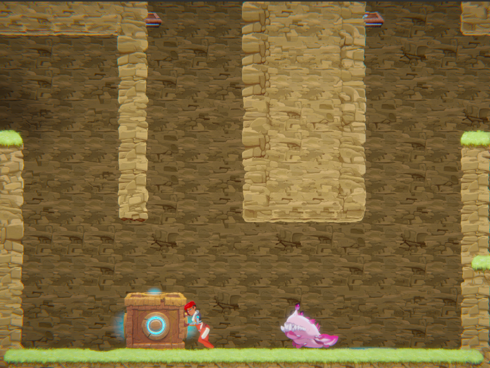
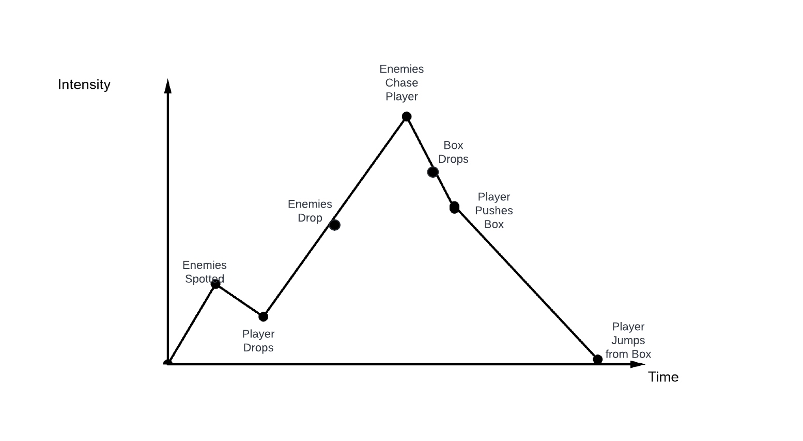
### 1.3. Challenge
Challenge is presented in the level through platforming, enemies, and puzzle solving. In the first section of the level the player is introduced to spikes through a tower they must climb, where each floor of the tower requires precise jumps in order to not get damaged by the spikes. How this encounter manages difficulty is by starting easy and then increasing the challenge the further the player progresses through the encounter, building up the player’s skill in the process, and not blindsiding them with a challenge too difficult, ultimately retaining a sense of flow. The same approach is taken with enemies. Once the player picks up the staff and is able to handle enemies they are faced with a lone chomper, a relatively easy encounter, setting the bar for what its like to fight enemies. As the player progresses the quantity of chompers distributed in encounters increases to continuously raise this bar alongside the player’s skill growth. The third section of the level puts all of the player’s acquired skills to the test where the player will have to solve a large puzzle, fully utilising the platforming, combat, and problem-solving experience they have gained over the course of the level. This section of the level is designed to offer a satisfying sense of challenge where the difficulty curve is measured by the player’s own skill. 

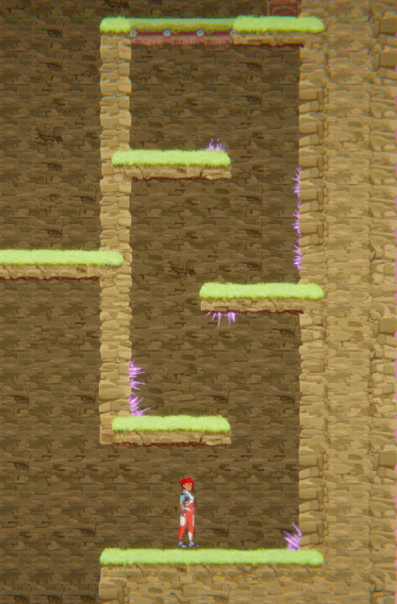
### 1.4. Exploration
The starting area where the player spawns act as a hub where the player can access all sections of the map, meaning they will have to pass through multiple times. The intention of this design is to create a familiar sense of space by reinforcing the location of these paths even though the player may not have the means to access it at that time. This is to prevent the player getting confused on where they can go and creates a reliable hub area that helps ground the player’s understanding of space in the level. 

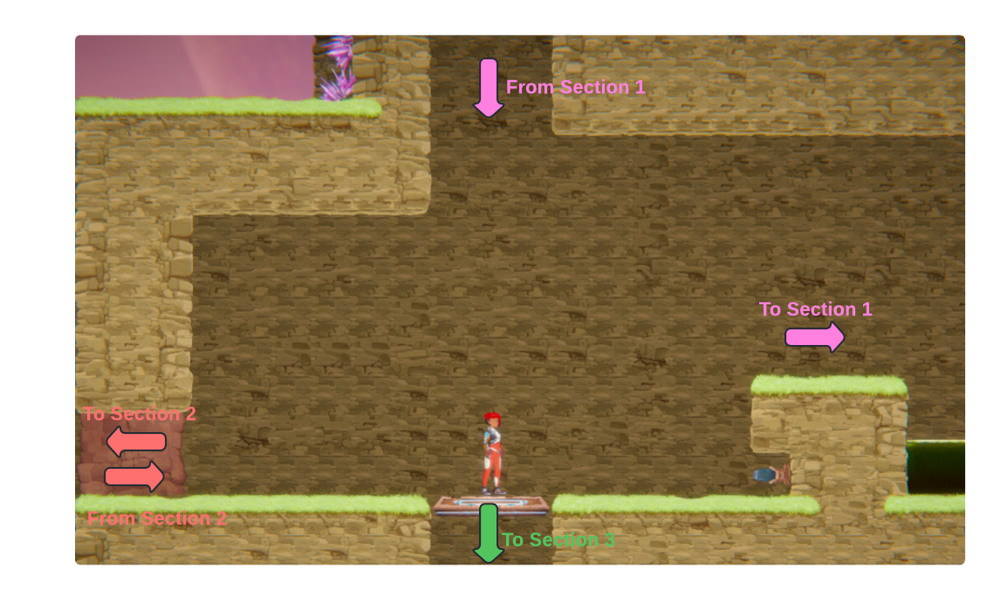
In the third section of the level, a large emphasis is placed on player autonomy and non-linearity. Upon reaching the start of section three the player has the freedom to travel and explore three different paths. The interconnected level design makes it so the paths blend together at certain points, meaning the player will not have to retread any large portion of the level and creates a sense of flow. This is especially important because the section itself acts as a big puzzle where the player needs to drop boxes onto acid in order to progress, and needing to backtrack may create confusion and deprive the feeling of progress. Depending on the path the player chooses they will encounter different challenges, so it is up to the player how they ultimately approach the level.

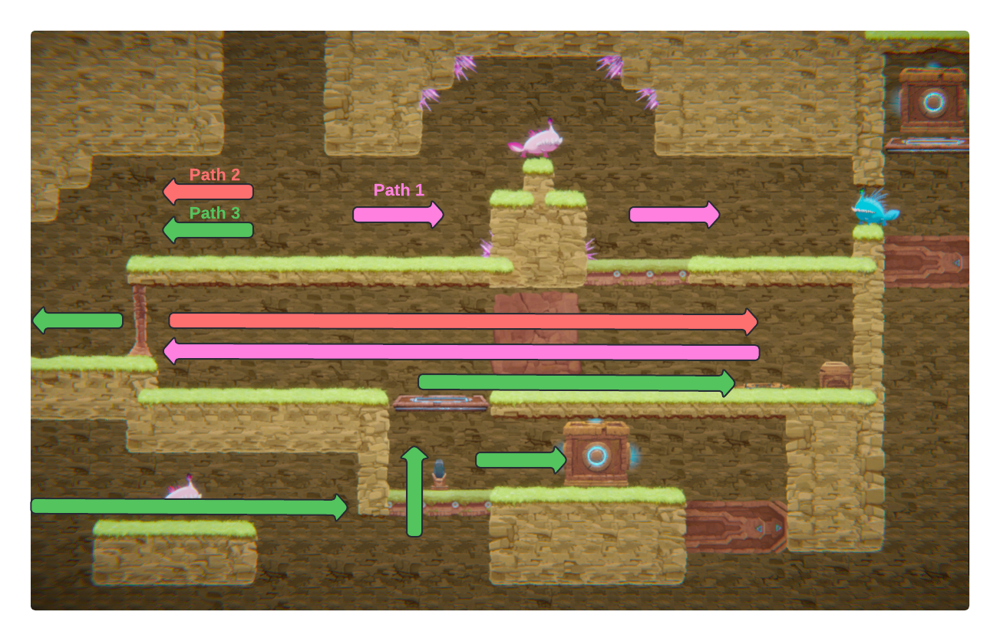

## 2. Core Gameplay
### 2.1. Acid
Acid is introduced first in section one as a dangerous environmental obstacle which the player should seek to avoid. Acid is used in the level to add challenge to platforming segments.
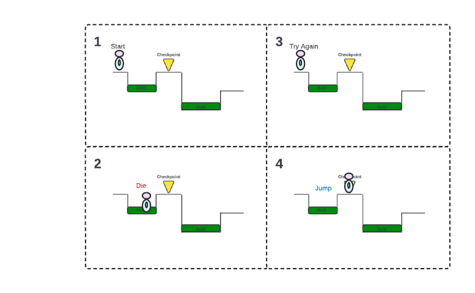
### 2.2. Checkpoints
Checkpoints are introduced during the same encounter as acid and can save the player from backtracking the entire level if they fall in acid.
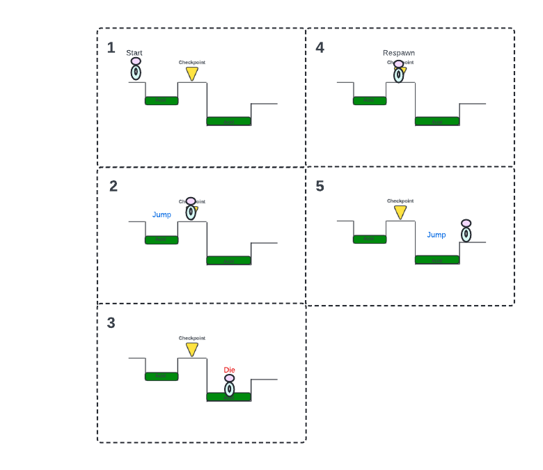
### 2.3. Moving Platforms
Towards the end of the acid platforming encounter moving platforms are introduced to add additional challenge.
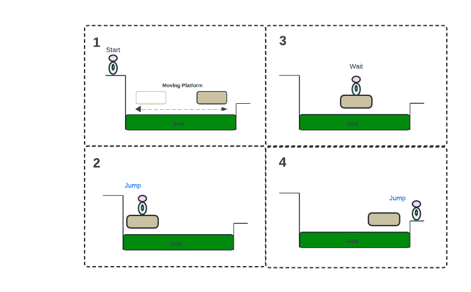
### 2.4. Spikes
Spikes are introduced to add more challenge to platforming by harming players who get to close.
### 2.5. Passthrough Platforms
Passthrough platforms are introduced as a wall the player can pass through and stand on to reach new areas.
### 2.6. Health Pickups
Health Pickups are introduced following the spike climb encounter as a way to heal the player following tough encounters.
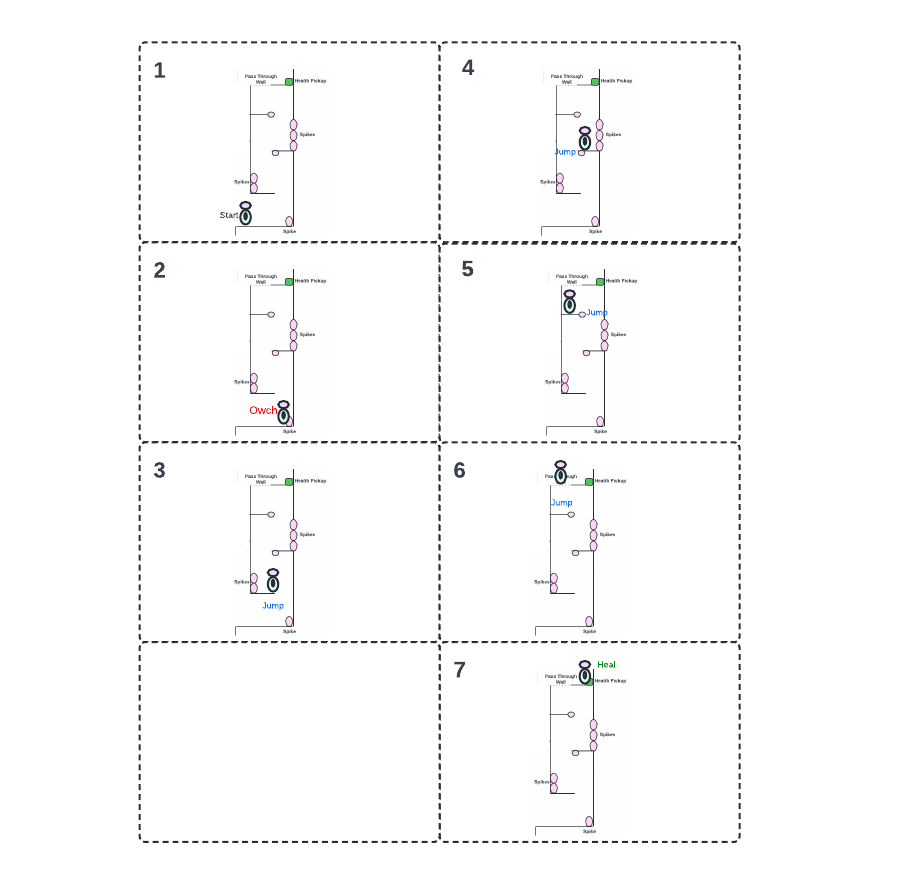
### 2.7. Gates (Bridges)
Bridges have been repurposed as gates which the player can open upon activating a switch or pressure plate. These gates hold enemies and boxes, and opening can be both beneficial and detrimental to the player.
### 2.8. Pressure Plates
Pressure plates are introduced as a device, which when activated, opens nearby gates. The pressure plate in this encounter when activated drops two chomper enemies and a box. 
### 2.9. Chompers
Chompers are introduced before the player has a means to deal with them, making them feel like a significant threat at this stage in the level.
### 2.10. Boxes
The box is an object the player can move by walking into it and is used at different points in the level to advance to new areas.
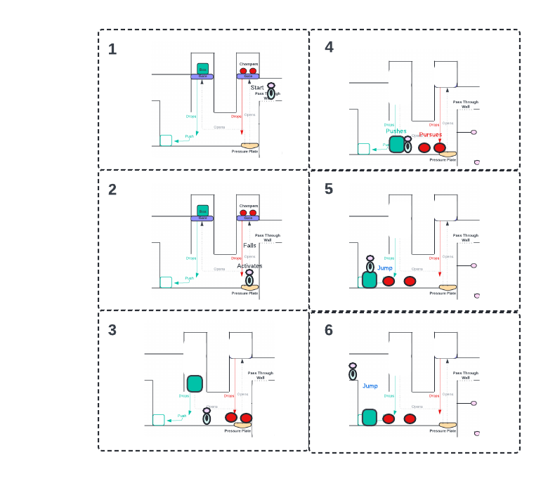
### 2.11. Weapon Pickup (Staff)
The staff weapon is introduced following the chomper chase encounter to relieve tension by giving the player an option to handle enemies and make them less of a threat.
### 2.12. Breakable Walls
The player uses their newly acquired staff to destroy a wall at the end of the hallway. The introduction here is purposeful in order to intuitively teach the player how to handle such obstacles. Upon falling to the starting place, the player will be facing another breakable wall which they know how to handle. 
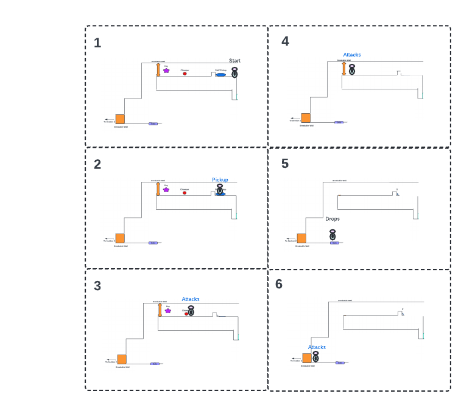
### 2.13. Spitters
Spitters are introduced as more challenging, ranged enemies.
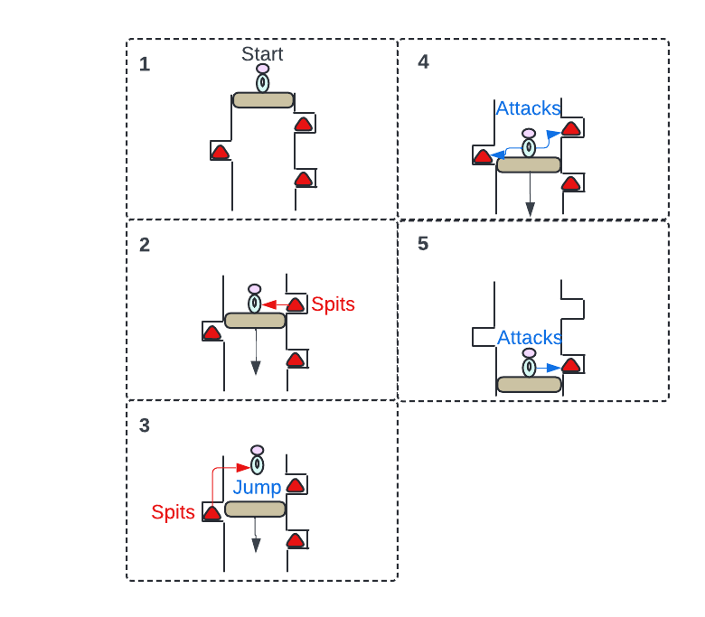
### 2.14. Weapon Pickup (Gun)
The weapon is introduced as a ranged weapon that can be used to effectively defeat spitters from a distance, as well as activating switches.
### 2.15. Switches
Switches can be fired at by the gun in order to activate gates or doors.
### 2.16. Doors
Doors are used in a similar way to gates to bar movement in certain directions where the player must solve a puzzle to progress.
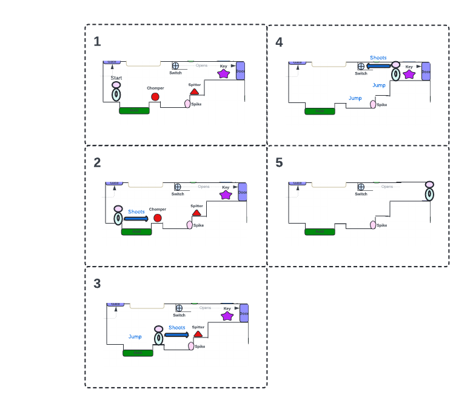
## 3. Spatiotemporal Design
### 3.1. Molecule Diagram
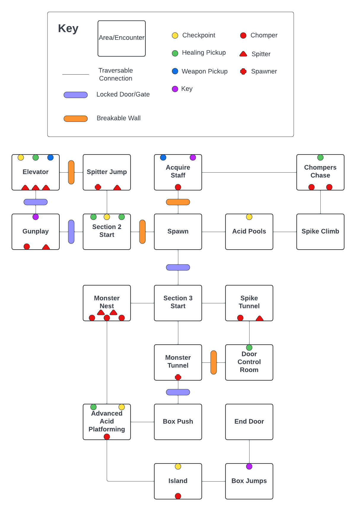
### 3.2. Level Map – Section 1
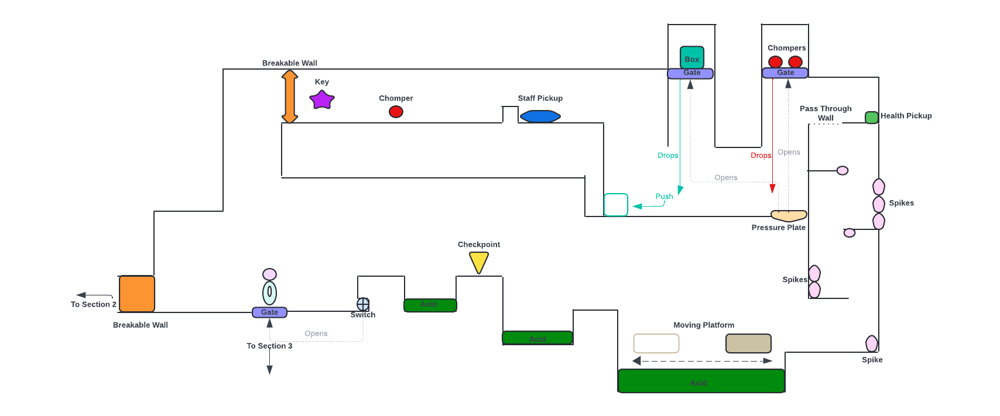
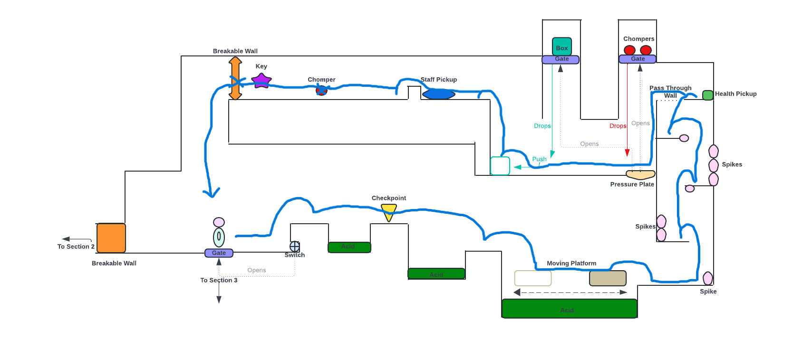
### 3.3.	Level Map – Section 2
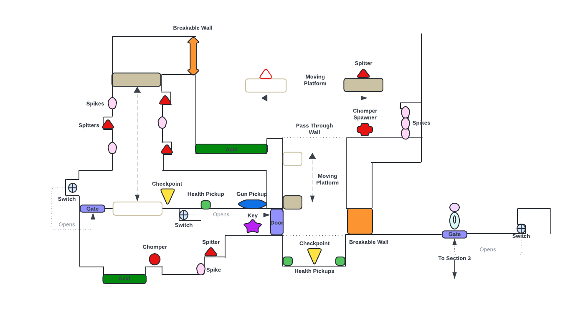
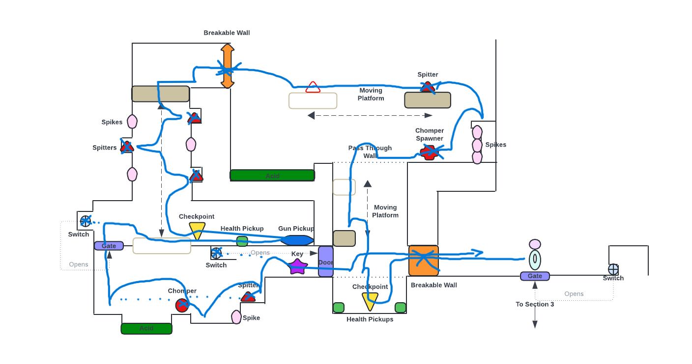
### 3.4.	Level Map – Section 3
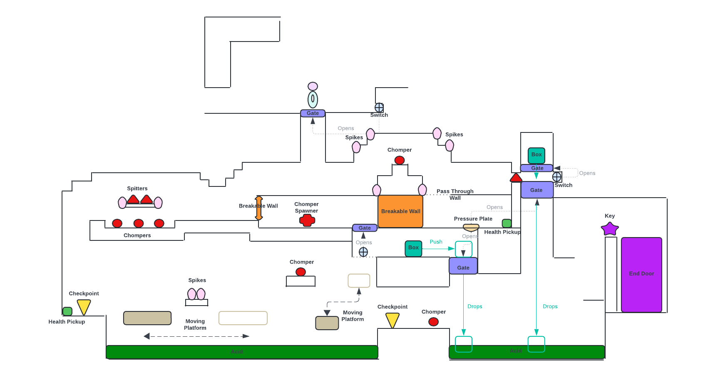
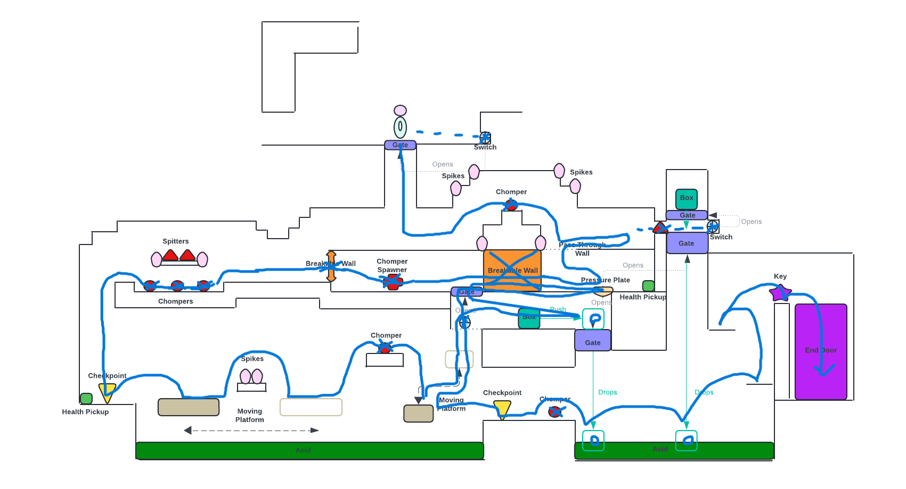

## 4. Iterative Design (~400 words)
Iterative design helped me improve my level by refining ideas from a concept to a prototype, and all the way to a final functional level. When designing the encounters I would first begin with conceptualising what I wanted the particular challenge to be. An example of this is an encounter where I wanted the player to use a moving platform in order to descend a tight area where the player would have to avoid the attacks of spitters. From this concept I would sketch out a rough design of what the encounter would look like.
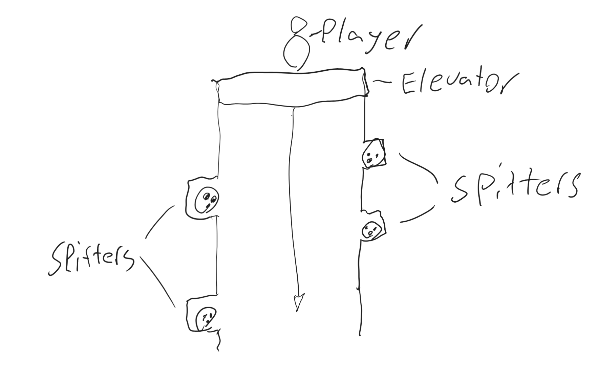
I would then refer to my in-progress level map to see where the encounter could fit into the design and when it could logically occur. Once I had decided the place for the encounter I would construct a storyboard for how the encounter would play out.

I would then create the encounter prototype in unity and playtest it. What I found was the encounter did not provide the type of challenge I wanted so I decided to expand upon the prototype by adding spikes to the level to make it more challenging for the player to avoid the spitter’s attacks while also encouraging them to get close to the spitters to attack them. After additional playtesting I was satisfied with my final result.
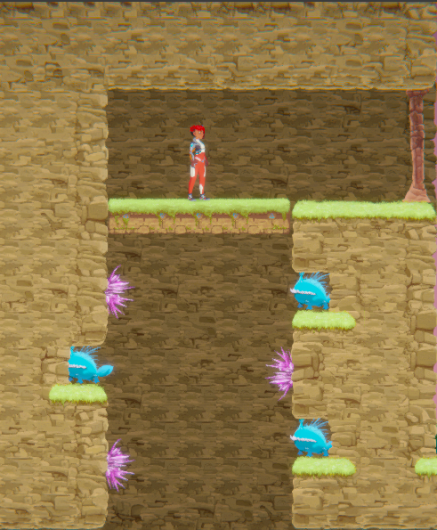

An example of encounters I believe could be further iterated upon for improvement are the later encounters featuring monsters. Currently they do not feel as challenging as they should be, and steps could be taken to flesh out the level design and quantity of enemies to make them more of a threat.

